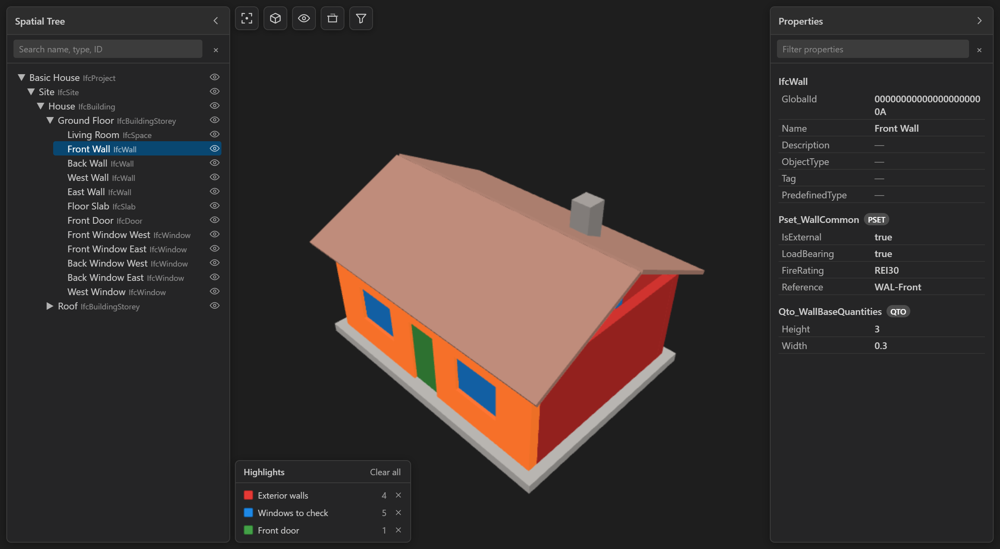

<p align="center">
  
</p>

<h1 align="center">IFC Viewer for VS Code</h1>

<p align="center">
  Open, explore, and inspect IFC building models in a fast 3D viewer inside VS Code,<br />
  and let an AI agent show its answers directly in the model.
</p>

<p align="center">
  <a href="https://marketplace.visualstudio.com/items?itemName=BharathikannanN.vscode-ifc-viewer"></a>
  <a href="https://open-vsx.org/extension/BharathikannanN/vscode-ifc-viewer"></a>
  <a href="https://github.com/nbharathik/vscode-ifc-viewer/actions/workflows/ci.yml"></a>
  <a href="LICENSE"></a>
</p>

<p align="center">
  
</p>

## Features

- **3D navigation.** Orbit, pan, and zoom, standard views, orthographic
  projection, and a live section plane.
- **Model structure.** A spatial tree synchronized with the 3D selection, plus
  every attribute, property set, and quantity of the selected element.
- **Find and focus.** Search by name, type, or GlobalId, filter by type and
  storey, and hide, isolate, or show elements.
- **Large models.** Parsing runs in a worker, geometry streams in
  progressively, and rendering is GPU-batched.
- **At home in VS Code.** Follows your light or dark theme and remembers the
  camera and panels.
- **AI agent pairing.** An agent such as Claude Code with IFC Skills sees your
  selection and highlights, isolates, and frames elements by GlobalId.

## Quick start

1. Install **IFC Viewer** from the
   [VS Code Marketplace](https://marketplace.visualstudio.com/items?itemName=BharathikannanN.vscode-ifc-viewer)
   or [Open VSX](https://open-vsx.org/extension/BharathikannanN/vscode-ifc-viewer)
   (Cursor, Windsurf, VSCodium), or run
   `code --install-extension BharathikannanN.vscode-ifc-viewer`.
2. Open any `.ifc` file. The viewer starts automatically.

Requires VS Code 1.96 or later.

| Input | Action |
| --- | --- |
| Left-drag / right-drag / wheel | Orbit / pan / zoom |
| `F` / double-click | Fit the model / fit an element |
| `H` / `I` / `A` | Hide / isolate / show all |
| `Esc` | Clear the selection |

## Pair with an AI agent

<p align="center">
  
</p>

Click **Connect to agent** (the plug icon in the viewer toolbar), then ask
your agent about the model. Its answers appear as colour-coded highlight
groups with a legend, and edits to the file reload automatically. Nothing is
written to your workspace until you connect, and the viewer stays read-only.
Agent authors can find the file protocol in
[docs/agent-bridge.md](docs/agent-bridge.md).

## Development

Node.js 20 or later is required.

```sh
npm install
npm run typecheck
npm run lint
npm run package
```

Press `F5` in VS Code to launch the Extension Development Host. See
[CONTRIBUTING.md](CONTRIBUTING.md) for the project layout and conventions.

## License

[MIT](LICENSE). Built on [web-ifc](https://github.com/ThatOpen/engine_web-ifc)
(MPL-2.0) and [Three.js](https://threejs.org/) (MIT).
