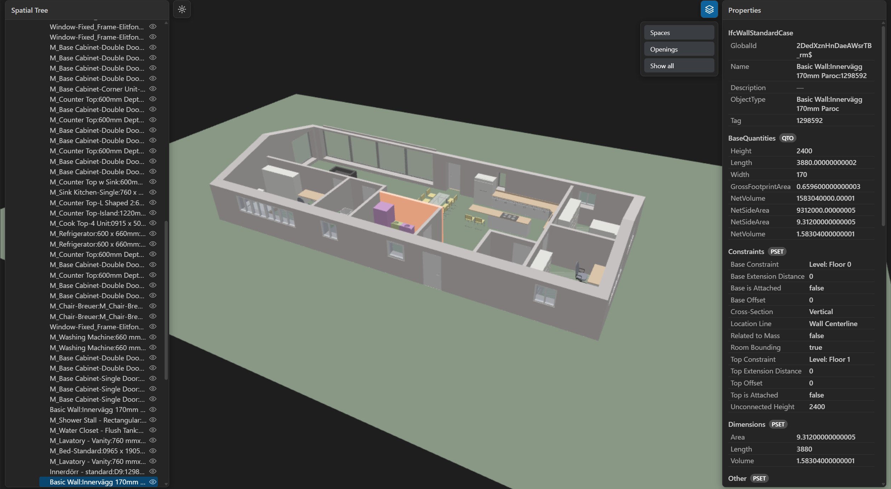

# IFC Viewer for VS Code

Open `.ifc` building models in a real 3D viewer inside VS Code. Orbit the
model, browse the spatial tree, click to select elements, and read their
properties. Built for large files: parsing runs in a worker, geometry streams
in progressively, and rendering is GPU-batched.

<p align="center">
  
</p>

## Features

- **3D viewport**: orbit, pan, zoom, fit-to-model, and fit-to-element.
- **Large models**: worker parsing, progressive streaming, GPU instancing, and
  frustum culling. The UI never freezes and the first geometry appears within
  seconds.
- **Spatial tree**: Project, Site, Building, Storey, and elements, expanded
  lazily.
- **Selection**: click in 3D to highlight, reveal in the tree, and show
  properties.
- **Properties**: direct attributes plus every property set and quantity set
  with values.
- **Visibility**: hide, isolate, or show all, with per-node toggles and a
  layers menu for spaces and openings. Isolate a single storey to inspect it
  on its own.
- **Theme**: the viewport and panels follow your VS Code light or dark theme.
- **Statistics**: entity counts by class, file size, and load phase timings.
- **Performance HUD**: press `P` for live render time, draw calls, and the
  load timeline.
- **Robust errors**: corrupt or oversized files show a readable in-view error
  card, never a blank tab.

The viewer is read-only. Editing, measurements, clipping planes, section
drawings, BCF, multi-model federation, IFC5, and WebGPU are out of scope for
now and tracked for later releases.

## Install

From the Visual Studio Marketplace: search for "IFC Viewer", or run
`code --install-extension vscode-ifc-viewer`. You can also install a packaged
build directly with `code --install-extension vscode-ifc-viewer-1.0.0.vsix`.

## Contributing

See [CONTRIBUTING.md](CONTRIBUTING.md) for setup, project layout, and the
checks every change has to keep green. In short:

```sh
npm install
npm run typecheck
npm run lint
npm run package -w packages/extension
```

Contributors can press `F5` in VS Code to launch the extension in an
Extension Development Host, or run `npm run harness:serve` for a plain
browser page with the same viewer.

## Usage

Open any `.ifc` file and the viewer starts automatically. The layout is a
spatial tree on the left, the 3D viewport in the middle, and a properties
panel on the right.

**Navigate the model**

- Left-drag to orbit, right-drag or middle-drag to pan, wheel to zoom.
- Press `F` to fit the whole model, or double-click an element to fit to it.

**Inspect elements**

- Click an element in 3D to select it: it highlights, the tree reveals it,
  and the properties panel shows its attributes, property sets, and
  quantities. Press `Esc` to clear the selection.
- Or browse the tree directly; selecting a node highlights it in 3D.

**Control visibility**

- With a selection: `H` hides it, `I` isolates it, `A` shows everything
  again. Each tree node also has its own visibility toggle.
- The layers menu toggles categories such as spaces and openings.

**Diagnostics**

- Press `P` for the performance HUD (render time, draw calls, load timeline).
- Command Palette: **IFC Viewer: Reset View** and
  **IFC Viewer: Show Statistics**.

## Credits and licenses

- Extension code is licensed under the [MIT License](LICENSE).
- [web-ifc](https://github.com/ThatOpen/engine_web-ifc) is licensed under MPL-2.0.
- [Three.js](https://threejs.org/) is licensed under MIT.
